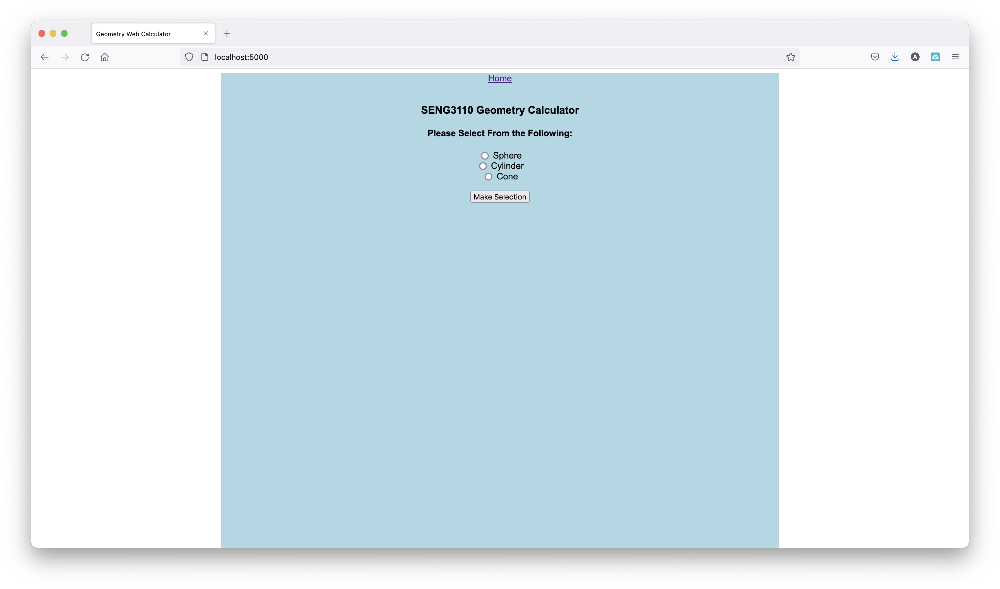

# Geometry Calculator Web

---

## App Prep & Run Steps

*To use this code do the following:*

1. **Pick a location on disk and clone this code into a local repository:**

    > git clone https://github.com/andersfnelson/flask-geometry

    (Alternatively the new GitHub CLI could also be used)

    A new directory will be created:  geometry_calculator_web   "cd" into it.

2. **Create a Python Virtual Environment**

    This is a simple Flask-based Python Web App.  It is advisable to use a Python Virtual Environment to keep this app's dependencies separate from other Python dependencies on the target machine. To create a Virtual Environment do the following from within the geometry_calculator_web directory: 

    Unix OS's:   
    > python3 -m venv venv

    Windows:
    > python -m venv venv

3. **Activate the Virtual Environment:**

    Unix OS's:  
    >source venv/bin/activate

    Windows:
    >venv\Scripts\activate.bat

4. **Install App Dependencies Using the Python Package Tool:**

    Rather than using pip to install the required packages, such as Flask, etc., all dependencies are in the requirements.txt file.

    > pip install -r requirements.txt

    In a virtual environment that was create using Python 3, on Unix OS's there no need to use pip3.  You can, but pip also works in this instance.

5. Run the Application:

    > python GeometryCalcWeb.py

    The App should now be running.  Access it via `localhost:5000`

    Running App:

    

## Python Unit Testing

This repo also contains four sample Unit Tests.

Run them by doing the following:

> python coneTest.py

> python cylinderTest.py

> python sphereTest.py

> python GeometryCalcWeb.py